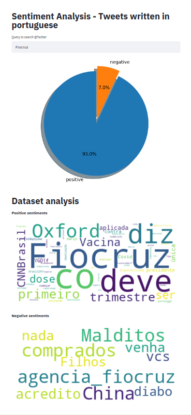

# portuguese-tweets-app

## How to use the app:
Repository created to stream tweets written in portuguese and predict if it is associated with a positive 
or negative sentiment.

To use this app you need to have access to Twitter API. To know more about this, please visit:
https://developer.twitter.com/en/docs/authentication/guides/authentication-best-practices

You can test locally this application by cloning this repository, access the path were you place it and run:

`pip install -r requirements.txt`

`streamlit run app.py`

It is also possible to run the application with Docker. To do this you will need to build the container 
and run the application:

`docker build -f Dockerfile -t app:latest .`

`docker run -p 8501:8501 app:latest`
  

# About this work: 
This work was develop using a dataset retrieved from:

https://www.kaggle.com/augustop/portuguese-tweets-for-sentiment-analysis

The dataset, used to train the machine learning models, have 100k tweets divided into positive (50%) and negative 
sentiment (50%). The tweets, without any theme, was collected during Aug/2018 to Oct/2018.

5 machine learning models were tested:
- Logistic regression: the simplest model tested to have a baseline and understand how much we improved from it
- MultinomialNB: learning algorithm based on applying Bayes’ theorem with the “naive” assumption of conditional 
independence between every pair of features given the value of the class variable. This Naive Bayes implementation 
is broadly used in text classification.
- Random forest: ensemble model of decision trees used to classify data
- Random forest with hyperparameters optimization: grid search experiment to to optimize the random forest model
- Ensemble model with Multinomial NB, Random forest, and Random forest optimized combined with the hard voting technique:
the model predicts class labels using the majority rule voting.

In our case, a false positive/negative is equally bad and for this reason, we choose to optimize f1-score. 
To evaluate the trained models this metric was chosen because it combines precision and recall in the same metric. 
Also, as it is a harmonic mean of the mentioned metrics, if precision or recall has a very low value, 
f1-score will decrease and show that some metric is low. 

As the grid-searching performed in this work was not very deep due to computational resources,
the model used in the app to classify tweets written in portuguese will be the random forest mainly for its result 
( f1-score = 0.77) and its lightness.

## Next steps:

- Acquire positive and negative data from Twitter every month. This will help the model to be updated
and learn new words
- Write a function to clean inappropriate words
- Develop a vault service to store passwords 
- Create test functions to ensure the quality of the data acquired and models
- Deploy app at Heroku plataform
- To scale this app it is possible to use Spark libraries: Koalas (same sintax as pandas) and ML

 

